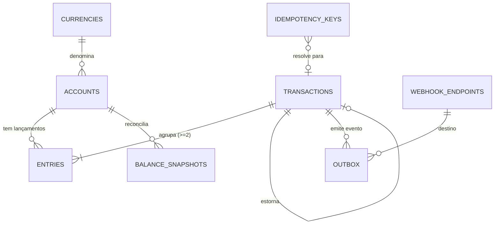
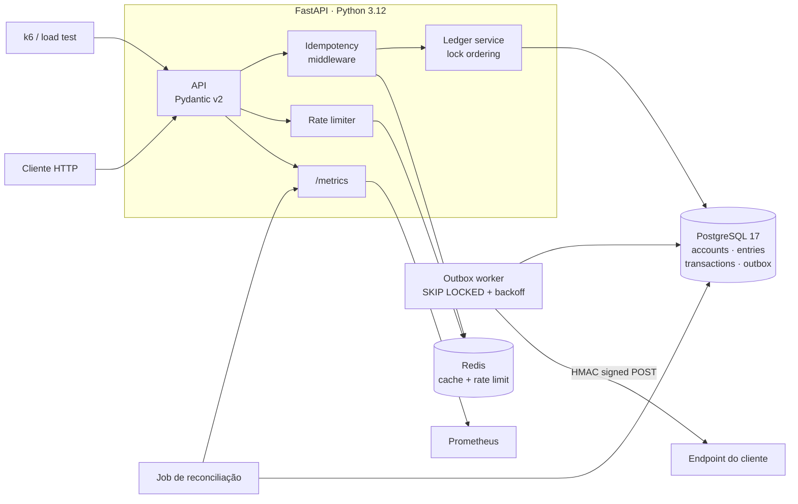

# Ledger Service — Design Doc (v0, para revisão)

> Documento de decisão **antes** do código. Escopo: schema, invariantes, estratégia de
> concorrência, idempotência e entrega de eventos. Nada aqui é implementado ainda.

**Decisões travadas na abertura:**

| Eixo | Decisão |
|---|---|
| Saldo | Materializado em `accounts.balance` + `entries` append-only + snapshots de reconciliação |
| Concorrência | Duas estratégias plugáveis (`row_lock` / `serializable`), ambas testadas e **medidas** no load test |
| Moeda | Multi-moeda sem FX (constraint bloqueia lançamento cross-currency) |
| Webhooks | Transactional outbox + worker separado |

---

## 1. Princípio norteador

O ponto do projeto não é "ter um endpoint de transferência". É demonstrar que você sabe
onde um sistema de dinheiro quebra sob concorrência e **onde colocar cada garantia**.

A regra que organiza todo o design:

> **Invariante de dinheiro mora no banco, não na aplicação.**

Se a única coisa impedindo saldo negativo é um `if` em Python, o sistema está a um bug de
race condition de distância de perder dinheiro. Cada invariante crítica abaixo tem uma
constraint de Postgres correspondente que a aplicação **não consegue** violar — nem por
bug, nem por `psql` manual, nem por migration mal feita.

As quatro invariantes duras:

| # | Invariante | Onde é garantida |
|---|---|---|
| I1 | Todo lançamento tem débito = crédito | `CONSTRAINT TRIGGER` deferred em `entries` |
| I2 | Conta de usuário nunca fica negativa | `CHECK (allow_negative OR balance >= 0)` |
| I3 | `entries` é imutável (append-only) | Trigger `BEFORE UPDATE OR DELETE` + `REVOKE` |
| I4 | Uma transação é estornada no máximo uma vez | Índice único parcial em `reverses_transaction_id` |

Duas invariantes moles (verificadas por job, expostas como métrica, não bloqueiam write):

| # | Invariante | Onde |
|---|---|---|
| I5 | `accounts.balance == SUM(entries)` | Job de reconciliação → `ledger_reconciliation_drift` |
| I6 | `SUM(débitos) == SUM(créditos)` global | Mesmo job |

I5 é o teste que prova que a decisão de materializar o saldo não introduziu divergência.
É o que eu mostraria primeiro numa entrevista.

---

## 2. Representação de dinheiro

**`BIGINT` em unidade menor** (centavos), nunca `float`, nunca `NUMERIC` para o saldo.

- Aritmética exata, sem arredondamento no meio do caminho.
- `SUM()` sobre `BIGINT` é exato e rápido; sobre `NUMERIC` é exato mas ~3-5x mais caro.
- `BIGINT` cobre ±9.2×10¹⁸ — em centavos, 92 quatrilhões de reais. Não estoura.
- É o que Stripe e Adyen fazem na API pública.

O expoente decimal vem da tabela `currencies` (BRL/USD = 2, JPY = 0, KWD = 3), então a
serialização sabe renderizar `12345 BRL` como `123.45`. **Na API o valor trafega como
inteiro em unidade menor** — nada de string decimal, nada de float em JSON.

`amount` é **sempre positivo**. O sinal é carregado pelo campo `direction` (`debit`/`credit`).
Isso elimina toda uma classe de bug de sinal invertido e torna o `CHECK (amount > 0)` trivial.

---

## 3. Schema

### 3.1 Diagrama de relacionamento



### 3.2 DDL

#### `currencies`

```sql
CREATE TABLE currencies (
    code      CHAR(3)  PRIMARY KEY,          -- ISO 4217
    exponent  SMALLINT NOT NULL CHECK (exponent BETWEEN 0 AND 4),
    name      TEXT     NOT NULL
);
-- seed: ('BRL',2,'Real'), ('USD',2,'US Dollar'), ('JPY',0,'Yen')
```

Tabela pequena e estática, mas transforma "moeda" de string mágica em FK. Custo zero,
elimina `currency='BRLL'` em produção.

#### `accounts`

```sql
CREATE TYPE account_type   AS ENUM ('asset','liability','equity','revenue','expense');
CREATE TYPE account_status AS ENUM ('active','frozen','closed');

CREATE TABLE accounts (
    id             UUID           PRIMARY KEY,           -- UUIDv7, gerado na app
    external_id    TEXT           NOT NULL,              -- ref do cliente
    owner_id       UUID           NOT NULL,
    currency       CHAR(3)        NOT NULL REFERENCES currencies(code),
    type           account_type   NOT NULL,
    status         account_status NOT NULL DEFAULT 'active',
    balance        BIGINT         NOT NULL DEFAULT 0,
    allow_negative BOOLEAN        NOT NULL DEFAULT false,
    version        BIGINT         NOT NULL DEFAULT 0,
    created_at     TIMESTAMPTZ    NOT NULL DEFAULT now(),
    updated_at     TIMESTAMPTZ    NOT NULL DEFAULT now(),

    CONSTRAINT accounts_external_id_uniq UNIQUE (external_id),
    CONSTRAINT accounts_balance_non_negative
        CHECK (allow_negative OR balance >= 0)          -- I2
);

CREATE INDEX accounts_owner_idx ON accounts (owner_id);
```

**Por que `UUID` e não `BIGSERIAL`:** o ID de conta vaza para o cliente. Sequencial permite
enumeração e revela volume de negócio. **Por que UUIDv7 e não v4:** v4 é aleatório, então
cada insert cai numa página random do B-tree → page splits, cache miss e inflação de WAL.
UUIDv7 tem prefixo temporal, mantém a localidade de inserção de um serial e ainda é opaco.
Em Postgres 18 dá para usar `uuidv7()` nativo; em 16/17 geramos na aplicação.

**Por que `allow_negative` em vez de "conta de sistema pode tudo":** contas de liquidação,
de resultado e a contrapartida de depósito externo **precisam** ficar negativas — é assim
que dinheiro entra no sistema sem sair do nada. Modelar isso como flag explícita por conta
é mais honesto do que um `if account.is_system` espalhado no código, e mantém a `CHECK`
válida para todas as linhas.

**Por que `type` (asset/liability/...):** sem isso o "double-entry" é decorativo. Com isso
dá para gerar balancete e provar que o passivo com clientes bate com o ativo em custódia —
que é a pergunta que um revisor do domínio vai fazer.

`version` não é usado para controle de concorrência (ver §4); serve para observabilidade e
para debugar quantas vezes uma conta quente foi tocada.

#### `transactions`

```sql
CREATE TYPE transaction_kind   AS ENUM ('transfer','deposit','withdrawal','reversal');
CREATE TYPE transaction_status AS ENUM ('posted','reversed');

CREATE TABLE transactions (
    id                      UUID               PRIMARY KEY,   -- UUIDv7
    kind                    transaction_kind   NOT NULL,
    status                  transaction_status NOT NULL DEFAULT 'posted',
    reverses_transaction_id UUID REFERENCES transactions(id),
    external_ref            TEXT,
    metadata                JSONB              NOT NULL DEFAULT '{}',
    created_at              TIMESTAMPTZ        NOT NULL DEFAULT now(),

    CONSTRAINT reversal_shape CHECK (
        (kind = 'reversal') = (reverses_transaction_id IS NOT NULL)
    )
);

-- I4: uma transação é estornada no máximo uma vez, garantido pelo banco
CREATE UNIQUE INDEX transactions_single_reversal_uniq
    ON transactions (reverses_transaction_id)
    WHERE reverses_transaction_id IS NOT NULL;

CREATE INDEX transactions_created_at_idx ON transactions (created_at DESC);
```

Não existe status `pending`. Uma transação nasce `posted` (atômica) ou não existe. Isso é
uma **limitação consciente**: pré-autorização/hold de cartão precisaria de um estado
intermediário e de saldo disponível ≠ saldo contábil. Está listado em §9 como trabalho futuro,
porque é o tipo de coisa que se promete e não se entrega em projeto de portfólio.

Estorno **nunca muta o original**. Cria uma nova transação com os lançamentos espelhados e
marca a original como `reversed`. O ledger continua append-only; a história fica auditável.

#### `entries` — o ledger propriamente dito

```sql
CREATE TYPE entry_direction AS ENUM ('debit','credit');

CREATE TABLE entries (
    id             BIGINT GENERATED ALWAYS AS IDENTITY PRIMARY KEY,
    transaction_id UUID            NOT NULL REFERENCES transactions(id),
    account_id     UUID            NOT NULL REFERENCES accounts(id),
    direction      entry_direction NOT NULL,
    amount         BIGINT          NOT NULL CHECK (amount > 0),
    currency       CHAR(3)         NOT NULL REFERENCES currencies(code),
    balance_after  BIGINT          NOT NULL,
    created_at     TIMESTAMPTZ     NOT NULL DEFAULT now()
);

-- extrato paginado por keyset: cobre WHERE account_id = ? ORDER BY id DESC
CREATE INDEX entries_account_id_idx ON entries (account_id, id DESC);
CREATE INDEX entries_transaction_idx ON entries (transaction_id);
```

`id` é `BIGINT` e não UUID: `entries` é a tabela que cresce sem parar e nunca é referenciada
externamente. 8 bytes vs 16 em cada linha e em cada índice, mais ordenação natural de
inserção — é a escolha certa aqui, mesmo tendo escolhido UUID em `accounts`. Decisões
diferentes para tabelas diferentes é o ponto.

`balance_after` é o saldo da conta **depois** deste lançamento. Torna o extrato auto-contido
(não precisa recomputar running total no SELECT) e é o artefato que permite auditar o saldo
sem varrer a tabela inteira. Só é correto porque é escrito sob o lock da linha da conta —
ver §4.

**I1 — débito = crédito, garantido pelo banco:**

```sql
CREATE FUNCTION assert_transaction_balanced() RETURNS TRIGGER AS $$
DECLARE
    net BIGINT;
    n   INT;
BEGIN
    SELECT COALESCE(SUM(CASE WHEN direction='debit' THEN amount ELSE -amount END), 0),
           COUNT(*)
      INTO net, n
      FROM entries WHERE transaction_id = NEW.transaction_id;

    IF n < 2 THEN
        RAISE EXCEPTION 'transaction % has % entries, minimum is 2',
            NEW.transaction_id, n USING ERRCODE = 'check_violation';
    END IF;
    IF net <> 0 THEN
        RAISE EXCEPTION 'transaction % is unbalanced by %',
            NEW.transaction_id, net USING ERRCODE = 'check_violation';
    END IF;
    RETURN NULL;
END;
$$ LANGUAGE plpgsql;

CREATE CONSTRAINT TRIGGER entries_balanced_trg
    AFTER INSERT ON entries
    DEFERRABLE INITIALLY DEFERRED
    FOR EACH ROW EXECUTE FUNCTION assert_transaction_balanced();
```

`DEFERRABLE INITIALLY DEFERRED` é o detalhe que faz funcionar: a checagem roda no `COMMIT`,
não no `INSERT`. Sem isso o primeiro `INSERT` (o débito, sozinho) já falharia. Com isso, é
**impossível** commitar um lançamento desbalanceado — inclusive via `psql`.

**I3 — imutabilidade:**

```sql
CREATE FUNCTION entries_are_immutable() RETURNS TRIGGER AS $$
BEGIN
    RAISE EXCEPTION 'entries are append-only (attempted %)', TG_OP
        USING ERRCODE = 'integrity_constraint_violation';
END;
$$ LANGUAGE plpgsql;

CREATE TRIGGER entries_immutable_trg
    BEFORE UPDATE OR DELETE ON entries
    FOR EACH ROW EXECUTE FUNCTION entries_are_immutable();

REVOKE UPDATE, DELETE ON entries FROM ledger_app;
```

Trigger **e** `REVOKE`: o `REVOKE` é a barreira real, o trigger dá a mensagem de erro
legível e cobre superusuário. Cinto e suspensório de propósito.

#### `idempotency_keys`

```sql
CREATE TYPE idempotency_status AS ENUM ('in_flight','completed','failed');

CREATE TABLE idempotency_keys (
    scope           TEXT               NOT NULL,   -- ex.: 'POST /v1/transfers'
    key             TEXT               NOT NULL,   -- header Idempotency-Key
    request_hash    TEXT               NOT NULL,   -- sha256 do body canonicalizado
    status          idempotency_status NOT NULL DEFAULT 'in_flight',
    response_status INT,
    response_body   JSONB,
    transaction_id  UUID REFERENCES transactions(id),
    created_at      TIMESTAMPTZ        NOT NULL DEFAULT now(),
    expires_at      TIMESTAMPTZ        NOT NULL,

    PRIMARY KEY (scope, key)
);

CREATE INDEX idempotency_expires_idx ON idempotency_keys (expires_at);
```

`scope` na PK: a mesma chave usada em endpoints diferentes não deve colidir. `request_hash`
detecta reuso de chave com payload diferente — que é erro do cliente e merece `422`, não um
replay silencioso da resposta errada (esse é o bug clássico de idempotência mal feita).

#### `webhook_endpoints` e `outbox`

```sql
CREATE TABLE webhook_endpoints (
    id         UUID        PRIMARY KEY,
    owner_id   UUID        NOT NULL,
    url        TEXT        NOT NULL,
    secret     BYTEA       NOT NULL,          -- chave HMAC-SHA256
    active     BOOLEAN     NOT NULL DEFAULT true,
    created_at TIMESTAMPTZ NOT NULL DEFAULT now()
);

CREATE TYPE outbox_status AS ENUM ('pending','delivering','delivered','dead');

CREATE TABLE outbox (
    id              BIGINT GENERATED ALWAYS AS IDENTITY PRIMARY KEY,
    endpoint_id     UUID          NOT NULL REFERENCES webhook_endpoints(id),
    event_type      TEXT          NOT NULL,   -- transaction.posted, transaction.reversed
    aggregate_id    UUID          NOT NULL,   -- transaction_id
    payload         JSONB         NOT NULL,
    status          outbox_status NOT NULL DEFAULT 'pending',
    attempts        INT           NOT NULL DEFAULT 0,
    next_attempt_at TIMESTAMPTZ   NOT NULL DEFAULT now(),
    last_error      TEXT,
    created_at      TIMESTAMPTZ   NOT NULL DEFAULT now(),
    delivered_at    TIMESTAMPTZ
);

-- índice parcial: só o que ainda importa entra no índice
CREATE INDEX outbox_due_idx ON outbox (next_attempt_at, id)
    WHERE status IN ('pending','delivering');
```

O índice parcial é o truque que faz a fila continuar rápida com 50M de eventos entregues:
linhas `delivered` saem do índice, então ele fica do tamanho do backlog, não do histórico.

#### `balance_snapshots`

```sql
CREATE TABLE balance_snapshots (
    account_id     UUID        NOT NULL REFERENCES accounts(id),
    as_of_entry_id BIGINT      NOT NULL,
    balance        BIGINT      NOT NULL,
    taken_at       TIMESTAMPTZ NOT NULL DEFAULT now(),
    PRIMARY KEY (account_id, as_of_entry_id)
);
```

Reconciliação incremental: em vez de somar a vida inteira da conta, soma do último snapshot
para frente.

```sql
-- drift de uma conta
SELECT a.balance - (s.balance + COALESCE(SUM(
           CASE WHEN e.direction = 'credit' THEN e.amount ELSE -e.amount END), 0)) AS drift
  FROM accounts a
  JOIN balance_snapshots s ON s.account_id = a.id
  LEFT JOIN entries e ON e.account_id = a.id AND e.id > s.as_of_entry_id
 WHERE a.id = $1
 GROUP BY a.balance, s.balance;
```

Resultado esperado: `0`, sempre. Vira a métrica `ledger_reconciliation_drift`. Se ela sair de
zero uma vez, o design de saldo materializado está errado e o README precisa dizer isso.

---

## 4. Estratégia de concorrência

### 4.1 O cenário que quebra

Duas requisições simultâneas debitando a conta A, que tem R$ 100:

```
T1: lê saldo=100 → valida 100>=80 → escreve 20
T2: lê saldo=100 → valida 100>=80 → escreve 20
```

Resultado: dois débitos de 80 sobre 100. O banco mostra 20. Sumiram 60 reais. Nenhuma
exceção foi lançada, nenhum log de erro, e a conciliação só descobre no dia seguinte.

Sob `READ COMMITTED` (default do Postgres) isso acontece — `READ COMMITTED` protege contra
leitura suja, não contra lost update.

### 4.2 Write path (estratégia `row_lock`, default)

```
1.  Claim de idempotência           (Redis NX → Postgres INSERT ON CONFLICT)
2.  BEGIN ISOLATION LEVEL READ COMMITTED
3.  SELECT ... FROM accounts WHERE id = ANY($1) ORDER BY id FOR UPDATE
       ↑ ids ordenados pela aplicação ANTES da query
4.  Validar: status='active', mesma currency, saldo suficiente
5.  INSERT transactions
6.  UPDATE accounts SET balance = balance - $amt WHERE id = $from RETURNING balance
    UPDATE accounts SET balance = balance + $amt WHERE id = $to   RETURNING balance
7.  INSERT entries (débito, crédito) com balance_after vindo do RETURNING
8.  INSERT outbox
9.  UPDATE idempotency_keys SET status='completed', response_body=...
10. COMMIT
       ↑ aqui disparam: constraint trigger I1 + CHECK I2
```

**Passo 3 é a linha mais importante do projeto.**

`FOR UPDATE` pega lock exclusivo de linha: a segunda transação **bloqueia** no `SELECT` até
a primeira commitar, e então relê o valor atualizado. O lost update desaparece.

`ORDER BY id` (com os ids também ordenados na aplicação) resolve o deadlock. Sem ordenação:

```
T1 (A→B): lock A ✓ ... espera B
T2 (B→A): lock B ✓ ... espera A
→ deadlock; Postgres mata uma das duas com SQLSTATE 40P01
```

Com ordenação total pelo UUID, toda transação adquire locks na mesma sequência. Não existe
ciclo de espera, logo não existe deadlock — é a condição de Coffman de espera circular sendo
quebrada por construção, não por retry.

**Nuance honesta:** o Postgres ordena antes de travar, e sob `READ COMMITTED` um
`EvalPlanQual` re-fetch pode teoricamente reordenar. Duas mitigações, decidir na revisão:
(a) travar em dois `SELECT ... FOR UPDATE` sequenciais na ordem já resolvida pela aplicação —
mais round-trips, ordem garantida; (b) `pg_advisory_xact_lock(hashtext(id))` nos dois ids em
ordem, o que dá ordenação determinística independente do plano. **Proponho (a)** por ser
explícito e não depender de hash; o custo de um round-trip extra aparece no load test e vira
número no README.

**Passo 6 usa `balance = balance - $amt`, não `balance = $novo_valor`.** Escrever o valor lido
na aplicação reintroduz o lost update se alguém remover o `FOR UPDATE` por engano. O UPDATE
relativo é correto mesmo sem lock; o `FOR UPDATE` está lá para validar a suficiência antes de
escrever e para estabelecer a ordem. Defesa em profundidade.

**Passo 10:** mesmo que tudo acima esteja errado, `CHECK (allow_negative OR balance >= 0)`
aborta a transação. A app não tem permissão de deixar o saldo negativo.

### 4.3 Estratégia `serializable` (alternativa medida)

`LOCK_STRATEGY=serializable`: `BEGIN ISOLATION LEVEL SERIALIZABLE`, sem `FOR UPDATE`, e retry
na aplicação em `SQLSTATE 40001` com backoff exponencial + jitter, limite de tentativas.

O Postgres usa SSI (Serializable Snapshot Isolation): rastreia dependências de leitura/escrita
e aborta uma das transações quando detecta um ciclo perigoso. Código de domínio mais limpo
(zero lock explícito), mas:

- Retry só é seguro porque a operação é idempotente por chave — a chave é reusada no retry.
- Sob conta quente, a taxa de aborto cresce com a contenção e o throughput **efetivo** cai,
  mesmo com o throughput bruto do banco parecendo alto. É exatamente esse gráfico que quero
  no README.

### 4.4 Por que não optimistic locking

`version` + `UPDATE ... WHERE version = $lida`, com retry no conflito. Funciona bem quando a
contenção é rara. O caso real de pagamentos é o oposto: **uma** conta de merchant recebendo
milhares de transações por segundo. Aí cada retry recompete com todos os outros retries e a
degradação é pior que linear. Mantenho a coluna `version` só como sinal de observabilidade.

Vale uma menção no README como quarta opção: `UPDATE accounts SET balance = balance - $amt
WHERE id = $1 AND (allow_negative OR balance >= $amt) RETURNING balance` — atômico, sem
`SELECT` prévio, `0 rows` significa saldo insuficiente. É o caminho mais rápido possível, mas
perde a validação conjunta das duas contas antes de qualquer escrita e ainda precisa de
ordenação para não deadlockar.

### 4.5 Comparação a ser medida (esqueleto da tabela do README)

| Estratégia | Isolamento | Deadlock | Falha sob contenção | Throughput esperado |
|---|---|---|---|---|
| `row_lock` | READ COMMITTED + `FOR UPDATE` | evitado por ordenação | espera (bloqueio) | **baseline** |
| `serializable` | SERIALIZABLE + retry | não aplicável | aborta `40001` | menor sob conta quente |

Números reais entram depois do k6. **Nada de número inventado no README.**

---

## 5. Idempotência

Duas camadas, com uma regra que não se quebra:

> **Redis é cache. Postgres é a verdade. Um miss no Redis cai no Postgres; um Redis vazio
> não pode causar transferência duplicada.**

```
POST /v1/transfers   Idempotency-Key: k

1. hash = sha256(body canonicalizado)
2. Redis: SET idem:{scope}:{k} {hash} NX EX 60
   ├─ ok      → provável primeira vez, segue
   └─ existe  → cai no passo 3 (não decide nada sozinho)
3. Postgres: INSERT INTO idempotency_keys (...) VALUES (...) ON CONFLICT DO NOTHING
   ├─ inseriu (1 row)  → nós somos os donos: executa a transferência
   └─ conflito (0 rows) → SELECT da linha existente:
        ├─ request_hash ≠ hash   → 422 idempotency_key_reuse
        ├─ status = completed    → replay: devolve response_body + response_status
        │                          com header Idempotency-Replayed: true
        ├─ status = in_flight    → 409 + Retry-After: 1
        └─ status = failed       → deixa tentar de novo
```

Pontos que costumam ser feitos errado e que quero explícitos no README:

- **O claim é `INSERT ... ON CONFLICT DO NOTHING`, não `SELECT` seguido de `INSERT`.** O
  segundo tem janela de corrida entre as duas queries. O primeiro é atômico: a unicidade da PK
  decide o vencedor, e o banco arbitra a corrida em vez da aplicação.
- **A linha de idempotência é escrita na mesma transação da transferência.** Não existe
  estado onde a transferência foi commitada mas o replay não funciona.
- **`request_hash` diferente = erro, não replay.** Devolver a resposta antiga para um payload
  novo é pior do que falhar: o cliente acha que mandou R$ 500 e recebe o `200` do R$ 50.
- **TTL de 24-72h**, com job de limpeza por `expires_at`. Chave expirada não é replay: é
  requisição nova. Documentar a janela na OpenAPI.

Estorno usa o mesmo mecanismo, com garantia adicional em I4: mesmo sem `Idempotency-Key`, o
índice único parcial impede o segundo estorno da mesma transação.

---

## 6. Webhooks — transactional outbox

O problema: `COMMIT` da transferência e `POST` para o cliente não podem ser atômicos entre si.
Qualquer ordem ingênua perde.

- Envia antes do commit → commit falha, cliente recebeu evento de algo que não aconteceu.
- Envia depois do commit → processo morre no meio, transferência existe sem evento.

Solução: o evento é escrito **na mesma transação** (passo 8 do §4.2). Se a transferência
commitou, o evento existe. Se não commitou, o evento não existe. Nunca há divergência.

Worker separado, em loop:

```sql
UPDATE outbox SET status = 'delivering', attempts = attempts + 1
 WHERE id IN (
     SELECT id FROM outbox
      WHERE status IN ('pending','delivering')
        AND next_attempt_at <= now()
      ORDER BY next_attempt_at, id
      LIMIT 100
      FOR UPDATE SKIP LOCKED
 )
RETURNING *;
```

`FOR UPDATE SKIP LOCKED` é o que permite rodar N workers em paralelo sem coordenação externa:
cada um pula as linhas já travadas por outro em vez de esperar. É o padrão canônico de fila em
Postgres e evita puxar Kafka/RabbitMQ para dentro do projeto só para entregar webhook.

Backoff exponencial com jitter, teto de 8 tentativas:

```
next_attempt_at = now() + min(2^attempts, 3600) segundos × jitter(0.5 – 1.5)
≈ 1s, 2s, 4s, 8s, 16s, 32s, 64s, 128s → depois: status='dead'
```

Jitter é obrigatório: sem ele, uma queda do endpoint do cliente faz todos os eventos
retentarem no mesmo instante e o thundering herd derruba o cliente de novo assim que ele volta.

Assinatura estilo Stripe, no header:

```
X-Ledger-Signature: t=1754899200,v1=<hex(hmac_sha256(secret, "{t}.{body}"))>
X-Ledger-Event-Id: <outbox.id>
```

O timestamp dentro do payload assinado impede replay do webhook por terceiro. `Event-Id`
estável entre retries permite que o **receptor** seja idempotente — entrega é at-least-once,
e isso vai documentado como contrato, não escondido.

---

## 7. API

```
POST   /v1/accounts                      Idempotency-Key
GET    /v1/accounts/{id}                 saldo + moeda
GET    /v1/accounts/{id}/entries         extrato paginado (keyset)
POST   /v1/transfers                     Idempotency-Key
GET    /v1/transactions/{id}
POST   /v1/transactions/{id}/reversal    Idempotency-Key
POST   /v1/webhook-endpoints
GET    /metrics                          Prometheus
GET    /health/live  /health/ready
```

**Paginação por keyset, não `OFFSET`.** `OFFSET 100000` faz o Postgres varrer e descartar
100 mil linhas — o extrato fica mais lento quanto mais antiga a página, e num ledger as
páginas antigas existem para sempre. O cursor é o `entries.id` do último item, opaco em
base64, servido pelo índice `(account_id, id DESC)` em tempo constante:

```
GET /v1/accounts/{id}/entries?limit=50&cursor=ZW50cnk6OTg3NjU0
→ { "data": [...], "next_cursor": "ZW50cnk6OTg3NjA0", "has_more": true }
```

Erros em RFC 9457 (`application/problem+json`), com `type` estável para o cliente programar
em cima:

```json
{
  "type": "https://ledger.dev/errors/insufficient-funds",
  "title": "Insufficient funds",
  "status": 422,
  "detail": "Account has 5000 BRL available, requested 8000 BRL",
  "account_id": "0190f8c2-...",
  "available": 5000,
  "requested": 8000
}
```

`422` para saldo insuficiente (requisição bem formada, estado inválido), `409` para conflito
de idempotência em voo, `429` para rate limit com `Retry-After`.

**Rate limiting:** sliding window em Redis via script Lua (INCR + EXPIRE numa operação
atômica — feitos separados, o EXPIRE pode se perder e a chave vaza para sempre). Escopo por
API key e por classe de endpoint; escrita é mais cara que leitura.

---

## 8. Testes, métricas e load test

### 8.1 Testes de concorrência (pytest + asyncio)

Regra: **cada task concorrente usa sua própria `AsyncSession`/conexão**. `asyncio.gather` sobre
uma sessão compartilhada não testa concorrência — testa serialização acidental do pool, passa
verde e não prova nada. Postgres real via testcontainers, nunca SQLite.

| # | Cenário | Asserção |
|---|---|---|
| C1 | 50 transferências simultâneas de conta com fundos para 10 | exatamente 10 × `201`, 40 × `422`; saldo final = 0; nunca negativo |
| C2 | 100× A→B e 100× B→A em paralelo | zero deadlock (`40P01`); soma total conservada |
| C3 | mesma `Idempotency-Key` disparada 20× em paralelo | 1 transação criada; 20 respostas idênticas |
| C4 | 10 estornos concorrentes da mesma transação | 1 sucesso, 9 × `409`/`422` |
| C5 | invariante global após C1-C4 | `SUM(débitos) == SUM(créditos)`; drift de reconciliação = 0 |
| C6 | C1 e C2 sob `LOCK_STRATEGY=serializable` | mesmas asserções passam |

C6 é o que justifica a arquitetura plugável: as duas estratégias passam na mesma suíte, então
a escolha entre elas é de performance, não de correção — e aí a tabela do load test decide.

### 8.2 Métricas Prometheus

```
ledger_transfer_duration_seconds{strategy,outcome}   histogram
ledger_transfers_total{outcome}                      counter
ledger_lock_wait_seconds                             histogram
ledger_serialization_failures_total                  counter   # 40001
ledger_deadlocks_total                               counter   # 40P01
ledger_idempotency_total{result,source}              counter   # hit/miss × redis/postgres
ledger_outbox_backlog                                gauge
ledger_webhook_delivery_total{outcome}               counter
ledger_reconciliation_drift                          gauge     # tem que ser 0
db_pool_connections{state}                           gauge
```

`ledger_lock_wait_seconds` é a métrica que mostra a contenção acontecendo em tempo real —
é o gráfico que conta a história do projeto melhor que qualquer parágrafo.

### 8.3 Load test (k6)

Três cenários, porque um número médio esconde justamente o que interessa:

1. **Baseline** — transferências entre pares aleatórios de 10k contas. Contenção ~zero.
   Mede o teto do stack (FastAPI + asyncpg + Postgres).
2. **Conta quente** — 90% das transferências mirando **uma** conta destino. É o caso real
   (merchant recebendo pagamentos) e é onde `row_lock` e `serializable` divergem.
3. **Tempestade de idempotência** — 30% de replays de chaves já usadas. Mede o custo do
   caminho de replay e valida que ele é mais barato que o caminho de escrita.

Tabela do README (a preencher com medição real):

| Cenário | VUs | req/s | p50 | p95 | p99 | erro % | deadlocks | 40001 |
|---|---|---|---|---|---|---|---|---|
| Baseline | 50 | — | — | — | — | — | — | — |
| Conta quente `row_lock` | 50 | — | — | — | — | — | — | — |
| Conta quente `serializable` | 50 | — | — | — | — | — | — | — |
| Replay idempotente | 50 | — | — | — | — | — | — | — |

Ambiente de execução (CPU, RAM, versões, `shared_buffers`, tamanho do pool) documentado junto
da tabela. Número de load test sem ambiente descrito não vale nada, e um revisor sênior sabe
disso.

---

## 9. Limitações conhecidas (vão para o README)

Escrever isso é parte do entregável, não um apêndice defensivo. Um portfólio que só lista
acertos parece que não foi testado de verdade.

1. **Sem hold/pré-autorização.** Não existe saldo disponível ≠ saldo contábil. Cartão precisa
   disso; PIX não. Fora de escopo, consciente.
2. **Sem FX.** Lançamento cross-currency é rejeitado por constraint. Câmbio exigiria conta de
   resultado, política de arredondamento e taxa versionada — projeto próprio.
3. **Escala vertical.** Todo o dinheiro numa instância Postgres. O caminho seria particionar
   `entries` por período e depois shardear por `account_id`, com transferência cross-shard
   virando saga com conta de trânsito. **Não implementar; explicar.** O `CONSTRAINT TRIGGER`
   de I1 tem atrito com particionamento (precisa ser criado por partição), e isso vai
   documentado como o custo real dessa escolha.
4. **Reconciliação em batch, não contínua.** Drift é detectado no job, não no instante do
   write. Trade-off explícito de latência de detecção por throughput.
5. **Webhook at-least-once.** O receptor precisa ser idempotente via `X-Ledger-Event-Id`.
   Exactly-once não existe em rede; prometer isso seria mentira.
6. **Sem multi-região.** Replicação síncrona cross-region colocaria consenso no caminho crítico
   do write e mudaria o perfil de latência por completo.
7. **`balance_after` assume ordenação por `entries.id`.** Válido porque o valor é escrito sob o
   lock da conta. Se algum dia houver escrita concorrente sem lock, esse campo perde o sentido —
   está anotado no código, não só aqui.

---

## 10. Arquitetura



Quatro processos no Compose: `api`, `outbox-worker`, `postgres`, `redis` — mais `prometheus` e
`k6` em profile opcional, para `docker compose up` continuar subindo só o essencial.

---

## 11. Decisões tomadas na revisão

Os pontos que ficaram em aberto na v0 deste documento foram fechados assim, e o
código reflete cada um:

| # | Questão | Decisão | Onde |
|---|---|---|---|
| 1 | Ordenação de lock: dois `SELECT FOR UPDATE` sequenciais ou `pg_advisory_xact_lock`? | **Dois SELECT sequenciais.** A ordem não depende do planner e o custo do round-trip extra aparece medido no load test. | `service._lock_accounts` |
| 2 | `entries.id` `BIGINT` vs UUIDv7 | **`BIGINT`.** `entries` é a tabela que cresce sem parar e nunca é referenciada externamente: 8 bytes contra 16 em cada linha e cada índice. Inconsistência consciente com `accounts.id`. | `sql/0001_up.sql` |
| 3 | `CONSTRAINT TRIGGER` vs validação só na aplicação | **Trigger.** Vale o atrito com particionamento futuro: a invariante fica impossível de violar, inclusive por `psql`. | `assert_transaction_balanced` |
| 4 | Estorno parcial? | **Só total.** Parcial mudaria I4 de "no máximo um" para "soma dos estornos ≤ original" e é escopo próprio. | §9, limitação |
| 5 | `currencies` como FK | **FK.** Custo próximo de zero e elimina `currency='BRLL'` chegando em produção. | `sql/0001_up.sql` |

### Correções que só apareceram ao rodar

Três problemas que o design não previu e os testes/medições pegaram:

1. **Ordenar o lock não bastava.** Os `UPDATE` de saldo iam na ordem origem→destino.
   Sob `serializable`, onde não há lock explícito, a ordem dos UPDATEs *é* a ordem de
   aquisição de lock — 95 de 100 transferências bidirecionais deadlockavam. A regra
   correta é mais ampla: **toda escrita em `accounts` respeita a ordem global**.

2. **O estorno checava o status antes de travar.** Os perdedores de uma corrida liam
   `posted` obsoleto e morriam adiante com "saldo insuficiente" — erro tecnicamente
   verdadeiro e semanticamente errado. Passou a travar `transactions` antes de decidir,
   o que fixou também a ordem de lock entre tabelas.

3. **Degradação sem circuit breaker é armadilha.** Com o Redis fora, cada requisição
   pagava o timeout de conexão: p50 de 920 ms. Correto e inutilizável ao mesmo tempo.

Ordem de implementação seguida: migrations + invariantes → testes de concorrência →
serviço de transferência → idempotência → estorno → métricas → CI → load test → outbox
→ rate limiting → reconciliação.
